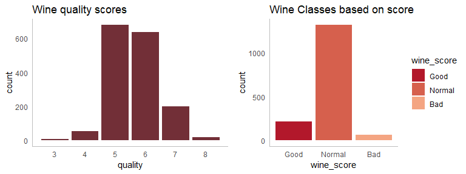
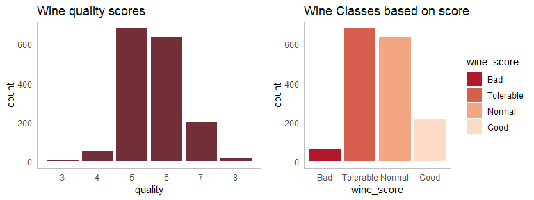
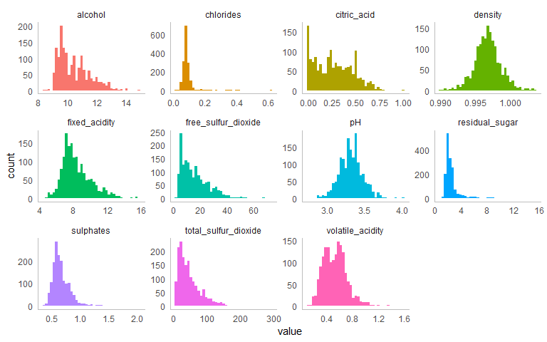
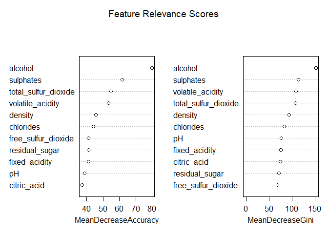
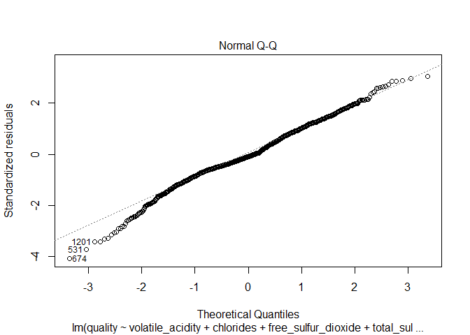
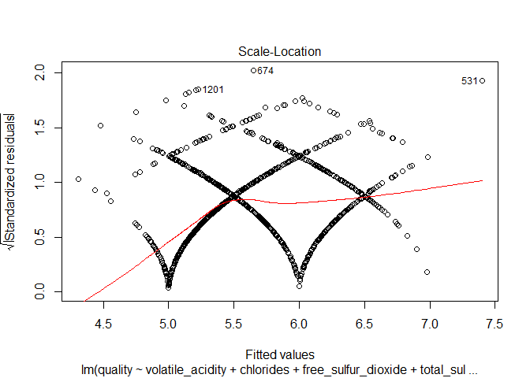
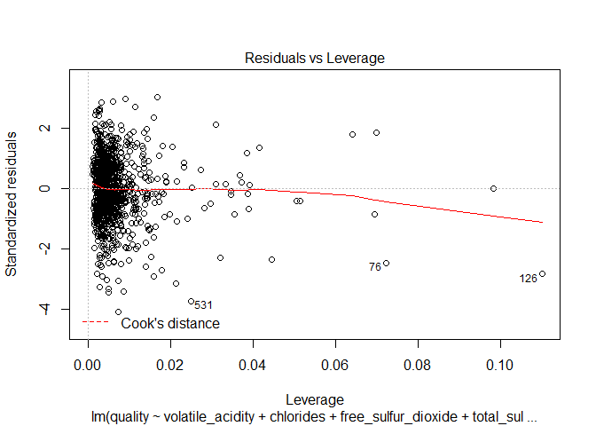
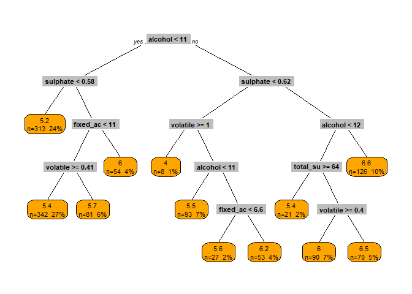

Red Wine Quality
----------------

The data set is sourced from Kaggle and contains wine data of the Portuguese "Vinho Verde" wine. The inspiration of this dataset is to use machine learning to determine physichemical properties that would make a good wine.

[Kaggle Source](www.kaggle.com/uciml/red-wine-quality-cortez-et-al-2009/home)

Objective
---------

Use machine learning to determine physichemical properties that would make a good wine. The dependant variable would be based on the quality of the wine.

Data Description
----------------

The data contains 1,599 observations accross 12 variables.

-   Fixed Acidity - most acids involved with wine or fixed or nonvolatile (do not evaporate readily)
-   volatile acidity- the amount of acetic acid in wine, which at too high of levels can lead to an unpleasant, vinegar taste
-   citric acid- found in small quantities, citric acid can add 'freshness' and flavor to wines
-   residual sugar- the amount of sugar remaining after fermentation stops, it's rare to find wines with less than 1 gram/liter and wines with greater than 45 grams/liter are considered sweet
-   chlorides- the amount of salt in the wine
-   free sulfur dioxide- the free form of SO2 exists in equilibrium between molecular SO2 (as a dissolved gas) and bisulfite ion; it prevents microbial growth and the oxidation of wine
-   total sulfur dioxide - amount of free and bound forms of S02; in low concentrations, SO2 is mostly undetectable in wine, but at free SO2 concentrations over 50 ppm, SO2 becomes evident in the nose and taste of wine
-   density - the density of water is close to that of water depending on the percent alcohol and sugar content
-   pH- describes how acidic or basic a wine is on a scale from 0 (very acidic) to 14 (very basic); most wines are between 3-4 on the pH scale
-   sulphates- a wine additive which can contribute to sulfur dioxide gas (S02) levels, wich acts as an antimicrobial and antioxidant
-   alcohol- the percent alcohol content of the wine
-   quality - output variable (based on sensory data, score between 0 and 10)

``` r
wine %>% skim() %>% kable()
```

    ## Skim summary statistics  
    ##  n obs: 1599    
    ##  n variables: 12    
    ## 
    ## Variable type: integer
    ## 
    ##  variable    missing    complete     n      mean     sd     p0    p25    p50    p75    p100      hist   
    ## ----------  ---------  ----------  ------  ------  ------  ----  -----  -----  -----  ------  ----------
    ##  quality        0         1599      1599    5.64    0.81    3      5      6      6      8      <U+2581><U+2581><U+2581><U+2587><U+2587><U+2581><U+2582><U+2581> 
    ## 
    ## Variable type: numeric
    ## 
    ##        variable          missing    complete     n      mean       sd       p0      p25      p50     p75     p100      hist   
    ## ----------------------  ---------  ----------  ------  -------  --------  -------  ------  -------  ------  ------  ----------
    ##        alcohol              0         1599      1599    10.42     1.07      8.4     9.5     10.2     11.1    14.9    <U+2582><U+2587><U+2585><U+2583><U+2582><U+2581><U+2581><U+2581> 
    ##       chlorides             0         1599      1599    0.087    0.047     0.012    0.07    0.079    0.09    0.61    <U+2587><U+2583><U+2581><U+2581><U+2581><U+2581><U+2581><U+2581> 
    ##      citric acid            0         1599      1599    0.27      0.19       0      0.09    0.26     0.42     1      <U+2587><U+2585><U+2585><U+2586><U+2582><U+2581><U+2581><U+2581> 
    ##        density              0         1599      1599      1      0.0019    0.99      1        1       1       1      <U+2581><U+2581><U+2583><U+2587><U+2587><U+2582><U+2581><U+2581> 
    ##     fixed acidity           0         1599      1599    8.32      1.74      4.6     7.1      7.9     9.2     15.9    <U+2581><U+2587><U+2587><U+2585><U+2582><U+2581><U+2581><U+2581> 
    ##  free sulfur dioxide        0         1599      1599    15.87    10.46       1       7       14       21      72     <U+2587><U+2587><U+2585><U+2582><U+2581><U+2581><U+2581><U+2581> 
    ##           pH                0         1599      1599    3.31      0.15     2.74     3.21    3.31     3.4     4.01    <U+2581><U+2581><U+2585><U+2587><U+2585><U+2581><U+2581><U+2581> 
    ##     residual sugar          0         1599      1599    2.54      1.41      0.9     1.9      2.2     2.6     15.5    <U+2587><U+2582><U+2581><U+2581><U+2581><U+2581><U+2581><U+2581> 
    ##       sulphates             0         1599      1599    0.66      0.17     0.33     0.55    0.62     0.73     2      <U+2582><U+2587><U+2582><U+2581><U+2581><U+2581><U+2581><U+2581> 
    ##  total sulfur dioxide       0         1599      1599    46.47     32.9       6       22      38       62     289     <U+2587><U+2585><U+2582><U+2581><U+2581><U+2581><U+2581><U+2581> 
    ##    volatile acidity         0         1599      1599    0.53      0.18     0.12     0.39    0.52     0.64    1.58    <U+2582><U+2587><U+2587><U+2583><U+2581><U+2581><U+2581><U+2581>

Exploratory data analysis
-------------------------

### Wine Quality

Wine quality is the target variable of the analysis so it's important we understand its distribution. There are a lot more normal wines than good or bad ones. For the analysis we will be classifying the wines into 3 classes: good, normal, and bad, where normal would be equal to 5 or 6. Normal wine is the majority class in the dataset with very limited bad wines.

``` r
#fix column names
colnames(wine) <- wine %>% colnames() %>% str_replace_all(" ","_")

#add new variables
wine <- wine %>%
  mutate(wine_score = ifelse(quality %in% 7:10, "Good", 
                             ifelse(quality %in% 0:4, "Bad", "Normal")),
         wine_score = factor(wine_score, levels=c("Good", "Normal", "Bad")))
```

``` r
library(RColorBrewer)
my_cols <- c(brewer.pal(9,"RdGy"))[1:3] # select 4 colors from class Reds

p1 <- ggplot(wine, aes(quality)) +
  geom_bar(stat="count", fill=chartcolor) +
    labs(title = "Wine quality scores") +
    scale_x_continuous(breaks = seq(1,10,1))+
  mychartattrib

p2 <- ggplot(wine, aes(wine_score, fill=wine_score)) +
  geom_bar(stat="count") +
    labs(title = "Wine Classes based on score") +
  scale_fill_manual(values = my_cols) +
  mychartattrib

grid.arrange(
  p1,
  p2,
  nrow=1
)
```



### Correlation

<http://www.sthda.com/english/wiki/visualize-correlation-matrix-using-correlogram>

Here we are trying to understand the strength of the relationship between the predictors of wine quality. Positive correlations are displayed in blue where negative correlations are displayed in red. Color intensity and size are proportional to the correlation coefficients. From below we are seeing that alcohol and volatile acidity are the most correlated with wine quality, where alcohol is negativly correlated and volatile acidity is positvely correlated.

``` r
#describe(wine)
w <- cor(wine[1:12])
corrplot(w, type = "upper")
```



### Physichemical properties

Here are the distributions of the physichemical properties of wine. Density and pH both appear the closest to a normal distribution.

``` r
wine %>%
  select(-quality) %>%
  keep(is.numeric) %>%
  gather() %>%
  ggplot(aes(x=value, fill=key)) +
  geom_histogram(bins=sqrt(nrow(wine))) +
  facet_wrap(~key, scales="free") +
  mychartattrib +
  theme(legend.position = "none") 
```



``` r
wine %>%
  select(-quality) %>%
  gather(key, value, -wine_score) %>%
  ggplot(aes(x=value, fill=wine_score)) +
  geom_density(alpha=0.25) +
  facet_wrap(~key, scales="free") +
  scale_fill_manual(values = my_cols) +
  mychartattrib
```


Modeling
--------

### Linear Regression

To predict the quality value of the wine between 3-8.

To assess the correlations of the model going to run an initial model on the entire data set; this is not used for model accuracy understanding, but instead is being used to understand the relationships of the variables in the data.

The portion of variance (R2) explained by the model below is 36%; which is not that impressive, but we can see the coefficients of the model and their importance to the model. Using the

``` r
wine_lm <- wine[, 1:12]
linear_model_full <- lm(formula = quality ~., data = wine_lm)
summary(linear_model_full)
```

    ## 
    ## Call:
    ## lm(formula = quality ~ ., data = wine_lm)
    ## 
    ## Residuals:
    ##      Min       1Q   Median       3Q      Max 
    ## -2.68911 -0.36652 -0.04699  0.45202  2.02498 
    ## 
    ## Coefficients:
    ##                        Estimate Std. Error t value Pr(>|t|)    
    ## (Intercept)           2.197e+01  2.119e+01   1.036   0.3002    
    ## fixed_acidity         2.499e-02  2.595e-02   0.963   0.3357    
    ## volatile_acidity     -1.084e+00  1.211e-01  -8.948  < 2e-16 ***
    ## citric_acid          -1.826e-01  1.472e-01  -1.240   0.2150    
    ## residual_sugar        1.633e-02  1.500e-02   1.089   0.2765    
    ## chlorides            -1.874e+00  4.193e-01  -4.470 8.37e-06 ***
    ## free_sulfur_dioxide   4.361e-03  2.171e-03   2.009   0.0447 *  
    ## total_sulfur_dioxide -3.265e-03  7.287e-04  -4.480 8.00e-06 ***
    ## density              -1.788e+01  2.163e+01  -0.827   0.4086    
    ## pH                   -4.137e-01  1.916e-01  -2.159   0.0310 *  
    ## sulphates             9.163e-01  1.143e-01   8.014 2.13e-15 ***
    ## alcohol               2.762e-01  2.648e-02  10.429  < 2e-16 ***
    ## ---
    ## Signif. codes:  0 '***' 0.001 '**' 0.01 '*' 0.05 '.' 0.1 ' ' 1
    ## 
    ## Residual standard error: 0.648 on 1587 degrees of freedom
    ## Multiple R-squared:  0.3606, Adjusted R-squared:  0.3561 
    ## F-statistic: 81.35 on 11 and 1587 DF,  p-value: < 2.2e-16

#### Stepwise regression

Adding more variables will not always create a better model; generally the simpler model is prefered. Including additional variables will reduce RMSE and increase the R2. Goal with stepwise regression is to find the model that minimizes AIC. AIC is a measure that penalizes the model with many variables.

``` r
bw_elim <- step(linear_model_full)
```

    ## Start:  AIC=-1375.49
    ## quality ~ fixed_acidity + volatile_acidity + citric_acid + residual_sugar + 
    ##     chlorides + free_sulfur_dioxide + total_sulfur_dioxide + 
    ##     density + pH + sulphates + alcohol
    ## 
    ##                        Df Sum of Sq    RSS     AIC
    ## - density               1     0.287 666.70 -1376.8
    ## - fixed_acidity         1     0.389 666.80 -1376.5
    ## - residual_sugar        1     0.498 666.91 -1376.3
    ## - citric_acid           1     0.646 667.06 -1375.9
    ## <none>                              666.41 -1375.5
    ## - free_sulfur_dioxide   1     1.694 668.10 -1373.4
    ## - pH                    1     1.957 668.37 -1372.8
    ## - chlorides             1     8.391 674.80 -1357.5
    ## - total_sulfur_dioxide  1     8.427 674.84 -1357.4
    ## - sulphates             1    26.971 693.38 -1314.0
    ## - volatile_acidity      1    33.620 700.03 -1298.8
    ## - alcohol               1    45.672 712.08 -1271.5
    ## 
    ## Step:  AIC=-1376.8
    ## quality ~ fixed_acidity + volatile_acidity + citric_acid + residual_sugar + 
    ##     chlorides + free_sulfur_dioxide + total_sulfur_dioxide + 
    ##     pH + sulphates + alcohol
    ## 
    ##                        Df Sum of Sq    RSS     AIC
    ## - fixed_acidity         1     0.108 666.81 -1378.5
    ## - residual_sugar        1     0.231 666.93 -1378.2
    ## - citric_acid           1     0.654 667.35 -1377.2
    ## <none>                              666.70 -1376.8
    ## - free_sulfur_dioxide   1     1.829 668.53 -1374.4
    ## - pH                    1     4.325 671.02 -1368.5
    ## - total_sulfur_dioxide  1     8.728 675.43 -1358.0
    ## - chlorides             1     8.761 675.46 -1357.9
    ## - sulphates             1    27.287 693.98 -1314.7
    ## - volatile_acidity      1    35.000 701.70 -1297.0
    ## - alcohol               1   119.669 786.37 -1114.8
    ## 
    ## Step:  AIC=-1378.54
    ## quality ~ volatile_acidity + citric_acid + residual_sugar + chlorides + 
    ##     free_sulfur_dioxide + total_sulfur_dioxide + pH + sulphates + 
    ##     alcohol
    ## 
    ##                        Df Sum of Sq    RSS     AIC
    ## - residual_sugar        1     0.257 667.06 -1379.9
    ## - citric_acid           1     0.565 667.37 -1379.2
    ## <none>                              666.81 -1378.5
    ## - free_sulfur_dioxide   1     1.901 668.71 -1376.0
    ## - pH                    1     7.065 673.87 -1363.7
    ## - chlorides             1     9.940 676.75 -1356.9
    ## - total_sulfur_dioxide  1    10.031 676.84 -1356.7
    ## - sulphates             1    27.673 694.48 -1315.5
    ## - volatile_acidity      1    36.234 703.04 -1295.9
    ## - alcohol               1   120.633 787.44 -1114.7
    ## 
    ## Step:  AIC=-1379.93
    ## quality ~ volatile_acidity + citric_acid + chlorides + free_sulfur_dioxide + 
    ##     total_sulfur_dioxide + pH + sulphates + alcohol
    ## 
    ##                        Df Sum of Sq    RSS     AIC
    ## - citric_acid           1     0.475 667.54 -1380.8
    ## <none>                              667.06 -1379.9
    ## - free_sulfur_dioxide   1     2.064 669.13 -1377.0
    ## - pH                    1     7.138 674.20 -1364.9
    ## - total_sulfur_dioxide  1     9.828 676.89 -1358.5
    ## - chlorides             1     9.832 676.89 -1358.5
    ## - sulphates             1    27.446 694.51 -1317.5
    ## - volatile_acidity      1    35.977 703.04 -1297.9
    ## - alcohol               1   122.667 789.73 -1112.0
    ## 
    ## Step:  AIC=-1380.79
    ## quality ~ volatile_acidity + chlorides + free_sulfur_dioxide + 
    ##     total_sulfur_dioxide + pH + sulphates + alcohol
    ## 
    ##                        Df Sum of Sq    RSS     AIC
    ## <none>                              667.54 -1380.8
    ## - free_sulfur_dioxide   1     2.394 669.93 -1377.1
    ## - pH                    1     7.073 674.61 -1365.9
    ## - total_sulfur_dioxide  1    10.787 678.32 -1357.2
    ## - chlorides             1    10.809 678.35 -1357.1
    ## - sulphates             1    27.060 694.60 -1319.2
    ## - volatile_acidity      1    42.318 709.85 -1284.5
    ## - alcohol               1   124.483 792.02 -1109.4

``` r
summary(bw_elim)
```

    ## 
    ## Call:
    ## lm(formula = quality ~ volatile_acidity + chlorides + free_sulfur_dioxide + 
    ##     total_sulfur_dioxide + pH + sulphates + alcohol, data = wine_lm)
    ## 
    ## Residuals:
    ##      Min       1Q   Median       3Q      Max 
    ## -2.68918 -0.36757 -0.04653  0.46081  2.02954 
    ## 
    ## Coefficients:
    ##                        Estimate Std. Error t value Pr(>|t|)    
    ## (Intercept)           4.4300987  0.4029168  10.995  < 2e-16 ***
    ## volatile_acidity     -1.0127527  0.1008429 -10.043  < 2e-16 ***
    ## chlorides            -2.0178138  0.3975417  -5.076 4.31e-07 ***
    ## free_sulfur_dioxide   0.0050774  0.0021255   2.389    0.017 *  
    ## total_sulfur_dioxide -0.0034822  0.0006868  -5.070 4.43e-07 ***
    ## pH                   -0.4826614  0.1175581  -4.106 4.23e-05 ***
    ## sulphates             0.8826651  0.1099084   8.031 1.86e-15 ***
    ## alcohol               0.2893028  0.0167958  17.225  < 2e-16 ***
    ## ---
    ## Signif. codes:  0 '***' 0.001 '**' 0.01 '*' 0.05 '.' 0.1 ' ' 1
    ## 
    ## Residual standard error: 0.6477 on 1591 degrees of freedom
    ## Multiple R-squared:  0.3595, Adjusted R-squared:  0.3567 
    ## F-statistic: 127.6 on 7 and 1591 DF,  p-value: < 2.2e-16

Run the multiple linear regression on the suggested predictors as selected by backwards elimination.

The proportion of variance explained by the model of 35% is still not great, so this suggests this type of modeling may not be right for the data.

``` r
library(caTools)
set.seed(123)
split <-sample.split(wine_lm$quality, SplitRatio = 0.8)
train <-subset(wine_lm, split == TRUE)
test <- subset(wine_lm, split == FALSE)

linear_model_2 <- lm(formula = quality ~ volatile_acidity + chlorides + free_sulfur_dioxide + total_sulfur_dioxide + pH + sulphates + alcohol, 
                data = train) 
summary(linear_model_2)
```

    ## 
    ## Call:
    ## lm(formula = quality ~ volatile_acidity + chlorides + free_sulfur_dioxide + 
    ##     total_sulfur_dioxide + pH + sulphates + alcohol, data = train)
    ## 
    ## Residuals:
    ##      Min       1Q   Median       3Q      Max 
    ## -2.65073 -0.36593 -0.05744  0.46318  1.96471 
    ## 
    ## Coefficients:
    ##                        Estimate Std. Error t value Pr(>|t|)    
    ## (Intercept)           4.4948865  0.4550300   9.878  < 2e-16 ***
    ## volatile_acidity     -0.9091582  0.1133057  -8.024 2.31e-15 ***
    ## chlorides            -2.0537295  0.4346407  -4.725 2.56e-06 ***
    ## free_sulfur_dioxide   0.0038475  0.0024361   1.579    0.115    
    ## total_sulfur_dioxide -0.0031973  0.0007645  -4.182 3.09e-05 ***
    ## pH                   -0.5427825  0.1334475  -4.067 5.05e-05 ***
    ## sulphates             0.8727330  0.1266074   6.893 8.57e-12 ***
    ## alcohol               0.2990284  0.0189449  15.784  < 2e-16 ***
    ## ---
    ## Signif. codes:  0 '***' 0.001 '**' 0.01 '*' 0.05 '.' 0.1 ' ' 1
    ## 
    ## Residual standard error: 0.6512 on 1270 degrees of freedom
    ## Multiple R-squared:  0.3513, Adjusted R-squared:  0.3477 
    ## F-statistic: 98.24 on 7 and 1270 DF,  p-value: < 2.2e-16

``` r
plot(linear_model_2)
```



``` r
predicted <- predict(linear_model_2, newdata = test)
```

### Decision tree - regression

``` r
library(rpart)

dtr_model <- rpart(quality ~., data = train)
dtr_model
```

    ## n= 1278 
    ## 
    ## node), split, n, deviance, yval
    ##       * denotes terminal node
    ## 
    ##  1) root 1278 830.08140 5.635368  
    ##    2) alcohol< 10.525 790 343.00760 5.364557  
    ##      4) sulphates< 0.575 313 111.32910 5.156550 *
    ##      5) sulphates>=0.575 477 209.24950 5.501048  
    ##       10) fixed_acidity< 10.95 423 163.96220 5.434988  
    ##         20) volatile_acidity>=0.405 342 115.04090 5.362573 *
    ##         21) volatile_acidity< 0.405 81  39.55556 5.740741 *
    ##       11) fixed_acidity>=10.95 54  28.98148 6.018519 *
    ##    3) alcohol>=10.525 488 335.34430 6.073770  
    ##      6) sulphates< 0.615 181 124.11050 5.668508  
    ##       12) volatile_acidity>=1.015 8   4.00000 4.000000 *
    ##       13) volatile_acidity< 1.015 173  96.80925 5.745665  
    ##         26) alcohol< 11.45 93  47.22581 5.516129 *
    ##         27) alcohol>=11.45 80  38.98750 6.012500  
    ##           54) fixed_acidity< 6.55 27  12.66667 5.555556 *
    ##           55) fixed_acidity>=6.55 53  17.81132 6.245283 *
    ##      7) sulphates>=0.615 307 163.98050 6.312704  
    ##       14) alcohol< 11.55 181  92.20994 6.099448  
    ##         28) total_sulfur_dioxide>=64 21  11.14286 5.428571 *
    ##         29) total_sulfur_dioxide< 64 160  70.37500 6.187500  
    ##           58) volatile_acidity>=0.395 90  25.82222 5.955556 *
    ##           59) volatile_acidity< 0.395 70  33.48571 6.485714 *
    ##       15) alcohol>=11.55 126  51.71429 6.619048 *

``` r
library(rpart.plot) 
```

    ## Warning: package 'rpart.plot' was built under R version 3.5.2

``` r
prp(dtr_model,extra=101,box.col="orange",split.box.col="grey")
```



### Classification

To predict if the wine is good, normal, or bad. Used to predict a class.

References and sources
----------------------

<https://www.kaggle.com/meepbobeep/intro-to-regression-and-classification-in-r/code>

<https://www.kaggle.com/mrshih/time-to-wine-down-and-avoid-pour-decisions-eda>

<https://www.kaggle.com/grosvenpaul/beginners-guide-to-eda-and-random-forest-using-r>
