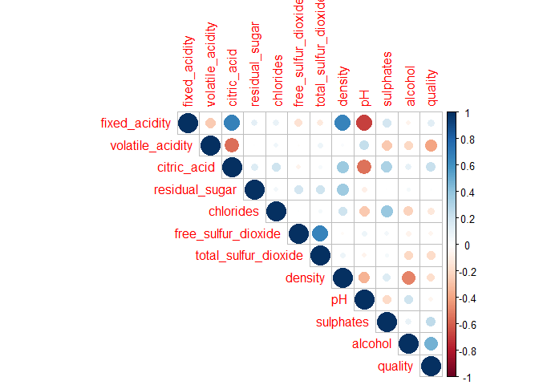

Red Wine Quality
----------------

The data set is sourced from Kaggle and contains wine data of the Portuguese "Vinho Verde" wine. The inspiration of this dataset is to use machine learning to determine physichemical properties that would make a good wine.

www.kaggle.com/uciml/red-wine-quality-cortez-et-al-2009/home

Objective
---------

Use machine learning to determine physichemical properties that would make a good wine. The dependant variable would be based on the quality of the wine.

Data Description
----------------

The data contains 1,599 observations accross 12 variables.

-   Fixed Acidity - most acids involved with wine or fixed or nonvolatile (do not evaporate readily)
-   volatile acidity- the amount of acetic acid in wine, which at too high of levels can lead to an unpleasant, vinegar taste
-   citric acid- found in small quantities, citric acid can add 'freshness' and flavor to wines
-   residual sugar- the amount of sugar remaining after fermentation stops, it's rare to find wines with less than 1 gram/liter and wines with greater than 45 grams/liter are considered sweet
-   chlorides- the amount of salt in the wine
-   free sulfur dioxide- the free form of SO2 exists in equilibrium between molecular SO2 (as a dissolved gas) and bisulfite ion; it prevents microbial growth and the oxidation of wine
-   total sulfur dioxide - amount of free and bound forms of S02; in low concentrations, SO2 is mostly undetectable in wine, but at free SO2 concentrations over 50 ppm, SO2 becomes evident in the nose and taste of wine
-   density - the density of water is close to that of water depending on the percent alcohol and sugar content
-   pH- describes how acidic or basic a wine is on a scale from 0 (very acidic) to 14 (very basic); most wines are between 3-4 on the pH scale
-   sulphates- a wine additive which can contribute to sulfur dioxide gas (S02) levels, wich acts as an antimicrobial and antioxidant
-   alcohol- the percent alcohol content of the wine
-   quality - output variable (based on sensory data, score between 0 and 10)

``` r
wine %>% skim() %>% kable()
```

    ## Skim summary statistics  
    ##  n obs: 1599    
    ##  n variables: 12    
    ## 
    ## Variable type: integer
    ## 
    ##  variable    missing    complete     n      mean     sd     p0    p25    p50    p75    p100      hist   
    ## ----------  ---------  ----------  ------  ------  ------  ----  -----  -----  -----  ------  ----------
    ##  quality        0         1599      1599    5.64    0.81    3      5      6      6      8      <U+2581><U+2581><U+2581><U+2587><U+2587><U+2581><U+2582><U+2581> 
    ## 
    ## Variable type: numeric
    ## 
    ##        variable          missing    complete     n      mean       sd       p0      p25      p50     p75     p100      hist   
    ## ----------------------  ---------  ----------  ------  -------  --------  -------  ------  -------  ------  ------  ----------
    ##        alcohol              0         1599      1599    10.42     1.07      8.4     9.5     10.2     11.1    14.9    <U+2582><U+2587><U+2585><U+2583><U+2582><U+2581><U+2581><U+2581> 
    ##       chlorides             0         1599      1599    0.087    0.047     0.012    0.07    0.079    0.09    0.61    <U+2587><U+2583><U+2581><U+2581><U+2581><U+2581><U+2581><U+2581> 
    ##      citric acid            0         1599      1599    0.27      0.19       0      0.09    0.26     0.42     1      <U+2587><U+2585><U+2585><U+2586><U+2582><U+2581><U+2581><U+2581> 
    ##        density              0         1599      1599      1      0.0019    0.99      1        1       1       1      <U+2581><U+2581><U+2583><U+2587><U+2587><U+2582><U+2581><U+2581> 
    ##     fixed acidity           0         1599      1599    8.32      1.74      4.6     7.1      7.9     9.2     15.9    <U+2581><U+2587><U+2587><U+2585><U+2582><U+2581><U+2581><U+2581> 
    ##  free sulfur dioxide        0         1599      1599    15.87    10.46       1       7       14       21      72     <U+2587><U+2587><U+2585><U+2582><U+2581><U+2581><U+2581><U+2581> 
    ##           pH                0         1599      1599    3.31      0.15     2.74     3.21    3.31     3.4     4.01    <U+2581><U+2581><U+2585><U+2587><U+2585><U+2581><U+2581><U+2581> 
    ##     residual sugar          0         1599      1599    2.54      1.41      0.9     1.9      2.2     2.6     15.5    <U+2587><U+2582><U+2581><U+2581><U+2581><U+2581><U+2581><U+2581> 
    ##       sulphates             0         1599      1599    0.66      0.17     0.33     0.55    0.62     0.73     2      <U+2582><U+2587><U+2582><U+2581><U+2581><U+2581><U+2581><U+2581> 
    ##  total sulfur dioxide       0         1599      1599    46.47     32.9       6       22      38       62     289     <U+2587><U+2585><U+2582><U+2581><U+2581><U+2581><U+2581><U+2581> 
    ##    volatile acidity         0         1599      1599    0.53      0.18     0.12     0.39    0.52     0.64    1.58    <U+2582><U+2587><U+2587><U+2583><U+2581><U+2581><U+2581><U+2581>

Exploratory data analysis
-------------------------

### Wine Quality

Wine quality is the target variable of the analysis so it's important we understand its distribution. There are a lot more normal wines than good or bad ones. For the analysis we will be classifying the wines into 4 classes: good, normal, tolerable and bad.

-   good = quality greater than 7
-   normal = qaulity of 6
-   tolerable = quality of 5
-   bad = under 4

``` r
#fix column names
colnames(wine) <- wine %>% colnames() %>% str_replace_all(" ","_")

#add new variables
wine <- wine %>%
  mutate(wine_score = ifelse(quality %in% 7:10, "Good", 
                             ifelse(quality %in% 0:4, "Bad", 
                                    ifelse(quality==6, "Normal", "Tolerable"))),
         wine_score = factor(wine_score, levels=c("Bad", "Tolerable", "Normal", "Good")))
```

``` r
table(wine$wine_score)
```

    ## 
    ##       Bad Tolerable    Normal      Good 
    ##        63       681       638       217

``` r
library(RColorBrewer)
my_cols <- c(brewer.pal(9,"RdGy"))[1:4] # select 4 colors from class Reds

p1 <- ggplot(wine, aes(quality)) +
  geom_bar(stat="count", fill=chartcolor) +
    labs(title = "Wine quality scores") +
    scale_x_continuous(breaks = seq(1,10,1))+
  mychartattrib

p2 <- ggplot(wine, aes(wine_score, fill=wine_score)) +
  geom_bar(stat="count") +
    labs(title = "Wine Classes based on score") +
  scale_fill_manual(values = my_cols) +
  mychartattrib

grid.arrange(
  p1,
  p2,
  nrow=1
)
```


### Correlation

<http://www.sthda.com/english/wiki/visualize-correlation-matrix-using-correlogram>

Here we are trying to understand the strength of the relationship between the predictors of wine quality. Positive correlations are displayed in blue where negative correlations are displayed in red. Color intensity and size are proportional to the correlation coefficients. From below we are seeing that alcohol and volatile acidity are the most correlated with wine quality, where alcohol is negativly correlated and volatile acidity is positvely correlated.

``` r
#describe(wine)
w <- cor(wine[1:12])
corrplot(w, type = "upper")
```



### Chemical properties

Here are the distributions of the physichemical properties of wine. Density and pH both appear the closest to a normal distribution.

``` r
wine %>%
  select(-quality) %>%
  keep(is.numeric) %>%
  gather() %>%
  ggplot(aes(x=value, fill=key)) +
  geom_histogram(bins=sqrt(nrow(wine))) +
  facet_wrap(~key, scales="free") +
  mychartattrib +
  theme(legend.position = "none") 
```


``` r
wine %>%
  select(-quality) %>%
  gather(key, value, -wine_score) %>%
  ggplot(aes(x=value, fill=wine_score)) +
  geom_density(alpha=0.25) +
  facet_wrap(~key, scales="free") +
  scale_fill_manual(values = my_cols) +
  mychartattrib
```


Modeling
--------

The goal is to model the class of the wine based on variables that are the chemical properties of the wine. Using EDA we have determine that alcohol, volatile acidity, citric acid, and sulphates appear to be the most correlated with wine quality.

### Random Forest for variable importance

``` r
library(randomForest)
wine2 <- wine %>% select(-quality)
fit <- randomForest(wine_score ~., data = wine2, importance=T)
importance(fit) # view results 
```

    ##                             Bad Tolerable   Normal     Good
    ## fixed_acidity         0.7027547  29.95710 21.91154 24.63529
    ## volatile_acidity     15.3629916  38.99059 25.53394 43.55975
    ## citric_acid           7.7604418  22.94049 22.00606 25.40341
    ## residual_sugar        2.2741893  27.71499 25.44622 26.31401
    ## chlorides             2.0669805  34.24462 25.02185 22.43214
    ## free_sulfur_dioxide   5.0979221  27.33401 25.25555 20.03476
    ## total_sulfur_dioxide  6.2361481  40.48652 34.32961 35.26615
    ## density              -1.8137402  29.42368 31.27829 30.03723
    ## pH                    6.0686434  27.93319 22.29602 23.70756
    ## sulphates             7.8594935  43.01193 39.94334 49.31280
    ## alcohol               4.6651509  66.13169 39.64259 53.14989
    ##                      MeanDecreaseAccuracy MeanDecreaseGini
    ## fixed_acidity                    41.08212         75.47112
    ## volatile_acidity                 53.27050        108.18594
    ## citric_acid                      37.30599         74.68562
    ## residual_sugar                   41.08767         70.75768
    ## chlorides                        44.01151         82.96125
    ## free_sulfur_dioxide              41.31443         67.51716
    ## total_sulfur_dioxide             54.92571        107.41698
    ## density                          45.59799         93.79113
    ## pH                               38.93779         76.48336
    ## sulphates                        61.66180        113.09109
    ## alcohol                          79.78617        151.22147

``` r
varImpPlot(fit,main="Feature Relevance Scores")
```


### Random Forest modeling

Initial unbalanced data set - randomly divide into train and test stratified by class and perform Random Forest with 5x5 repeated cross-validation.

``` r
#random sample 75/25 split
library(caTools)
set.seed(123)
split = sample.split(wine2$wine_score, SplitRatio = 0.75)
train = subset(wine2, split == TRUE)
test = subset(wine2, split == FALSE)
```

``` r
# Feature Scaling
train[-12] <- scale(train[-12])
test[-12] <- scale(test[-12])
```

``` r
# model on train
library(caret)
```

    ## Loading required package: lattice

    ## 
    ## Attaching package: 'caret'

    ## The following object is masked from 'package:purrr':
    ## 
    ##     lift

``` r
set.seed(42)
model_rf <- train(wine_score ~ .,
                         data = train,
                         method = "rf",
                         preProcess = c("scale", "center"),
                         trControl = trainControl(method = "repeatedcv", 
                                                  number = 5, 
                                                  repeats = 5, 
                                                  verboseIter = FALSE))
```

``` r
final <- data.frame(actual = test$wine_score,
                    predict(model_rf, newdata = test))
```

``` r
cm_original <- confusionMatrix(final$predict, test$wine_score)
cm_original
```

    ## Confusion Matrix and Statistics
    ## 
    ##            Reference
    ## Prediction  Bad Tolerable Normal Good
    ##   Bad         1         0      0    0
    ##   Tolerable  13       141     38    1
    ##   Normal      2        27    112   29
    ##   Good        0         2     10   24
    ## 
    ## Overall Statistics
    ##                                           
    ##                Accuracy : 0.695           
    ##                  95% CI : (0.6473, 0.7398)
    ##     No Information Rate : 0.425           
    ##     P-Value [Acc > NIR] : < 2.2e-16       
    ##                                           
    ##                   Kappa : 0.5022          
    ##  Mcnemar's Test P-Value : NA              
    ## 
    ## Statistics by Class:
    ## 
    ##                      Class: Bad Class: Tolerable Class: Normal Class: Good
    ## Sensitivity              0.0625           0.8294        0.7000      0.4444
    ## Specificity              1.0000           0.7739        0.7583      0.9653
    ## Pos Pred Value           1.0000           0.7306        0.6588      0.6667
    ## Neg Pred Value           0.9624           0.8599        0.7913      0.9176
    ## Prevalence               0.0400           0.4250        0.4000      0.1350
    ## Detection Rate           0.0025           0.3525        0.2800      0.0600
    ## Detection Prevalence     0.0025           0.4825        0.4250      0.0900
    ## Balanced Accuracy        0.5312           0.8017        0.7292      0.7049

Use SMOTE for unbalanced dataset - "Synthetic Minority Over-sampling Technique" - method that applies over-sampling to the minority class creating synthetic minority class examples.

``` r
#smote 
ctrl <- trainControl(method = "repeatedcv", 
                     number = 5, 
                     repeats = 5, 
                     verboseIter = FALSE,
                     sampling = "smote")

set.seed(42)
model_rf_smote <- train(wine_score ~ .,
                              data = train,
                              method = "rf",
                              preProcess = c("scale", "center"),
                              trControl = ctrl)
```

    ## Loading required package: grid

``` r
final_smote <- data.frame(actual = test$wine_score,
                         predict(model_rf_smote, newdata = test))
```

``` r
cm_smote <- confusionMatrix(final_smote$predict, test$wine_score)
cm_smote
```

    ## Confusion Matrix and Statistics
    ## 
    ##            Reference
    ## Prediction  Bad Tolerable Normal Good
    ##   Bad        11        43     25    8
    ##   Tolerable   4        92     33    3
    ##   Normal      1        34     82   20
    ##   Good        0         1     20   23
    ## 
    ## Overall Statistics
    ##                                           
    ##                Accuracy : 0.52            
    ##                  95% CI : (0.4698, 0.5699)
    ##     No Information Rate : 0.425           
    ##     P-Value [Acc > NIR] : 8.163e-05       
    ##                                           
    ##                   Kappa : 0.3135          
    ##  Mcnemar's Test P-Value : 8.605e-12       
    ## 
    ## Statistics by Class:
    ## 
    ##                      Class: Bad Class: Tolerable Class: Normal Class: Good
    ## Sensitivity              0.6875           0.5412        0.5125      0.4259
    ## Specificity              0.8021           0.8261        0.7708      0.9393
    ## Pos Pred Value           0.1264           0.6970        0.5985      0.5227
    ## Neg Pred Value           0.9840           0.7090        0.7034      0.9129
    ## Prevalence               0.0400           0.4250        0.4000      0.1350
    ## Detection Rate           0.0275           0.2300        0.2050      0.0575
    ## Detection Prevalence     0.2175           0.3300        0.3425      0.1100
    ## Balanced Accuracy        0.7448           0.6836        0.6417      0.6826

Compare predictions for the sampling methods

``` r
models <- list(original = model_rf,
                       smote = model_rf_smote)
resampling <- resamples(models)
bwplot(resampling)
```


``` r
# Feature Scaling
#train = scale(training_set[-3])
#test_set[-3] = scale(test_set[-3])


#compare train/test sets
table(train$wine_score)
```

    ## 
    ##       Bad Tolerable    Normal      Good 
    ##        47       511       478       163

``` r
table(test$wine_score)
```

    ## 
    ##       Bad Tolerable    Normal      Good 
    ##        16       170       160        54

``` r
#baseline model
rf_base <-randomForest(wine_score~.,train,ntree=150)

#Confusion matrix results
preds <- predict(rf_base, newdata=test)
table(preds, test$wine_score) #confusion matrix for test set
```

    ##            
    ## preds       Bad Tolerable Normal Good
    ##   Bad         1         0      0    0
    ##   Tolerable  13       138     37    2
    ##   Normal      2        30    111   29
    ##   Good        0         2     12   23

``` r
confusionMatrix(table(preds, test$wine_score))
```

    ## Confusion Matrix and Statistics
    ## 
    ##            
    ## preds       Bad Tolerable Normal Good
    ##   Bad         1         0      0    0
    ##   Tolerable  13       138     37    2
    ##   Normal      2        30    111   29
    ##   Good        0         2     12   23
    ## 
    ## Overall Statistics
    ##                                           
    ##                Accuracy : 0.6825          
    ##                  95% CI : (0.6344, 0.7279)
    ##     No Information Rate : 0.425           
    ##     P-Value [Acc > NIR] : < 2.2e-16       
    ##                                           
    ##                   Kappa : 0.4825          
    ##  Mcnemar's Test P-Value : NA              
    ## 
    ## Statistics by Class:
    ## 
    ##                      Class: Bad Class: Tolerable Class: Normal Class: Good
    ## Sensitivity              0.0625           0.8118        0.6937      0.4259
    ## Specificity              1.0000           0.7739        0.7458      0.9595
    ## Pos Pred Value           1.0000           0.7263        0.6453      0.6216
    ## Neg Pred Value           0.9624           0.8476        0.7851      0.9146
    ## Prevalence               0.0400           0.4250        0.4000      0.1350
    ## Detection Rate           0.0025           0.3450        0.2775      0.0575
    ## Detection Prevalence     0.0025           0.4750        0.4300      0.0925
    ## Balanced Accuracy        0.5312           0.7928        0.7198      0.6927

### Decision tree

``` r
library(rpart)
library(DMwR)

#apply model to training set
#dtr_model <- rpartXse(quality ~., data = train)

#predict values using test
#prediction <- predict(dtr_model,test) 
```

``` r
#library(rpart.plot) 
#prp(dtr_model,extra=101,box.col="orange",split.box.col="grey")
```

Sources and references:
-----------------------

-   Torgo, Luis. Data Mining in R. Oakville, Canada: Apple Academic Press Inc., 2017. Print.

-   <https://shiring.github.io/machine_learning/2017/04/02/unbalanced>

-   data source: www.kaggle.com/uciml/red-wine-quality-cortez-et-al-2009/home

-   <https://www.kaggle.com/meepbobeep/intro-to-regression-and-classification-in-r/code>

-   <https://www.kaggle.com/mrshih/time-to-wine-down-and-avoid-pour-decisions-eda>

-   <https://www.kaggle.com/grosvenpaul/beginners-guide-to-eda-and-random-forest-using-r>
